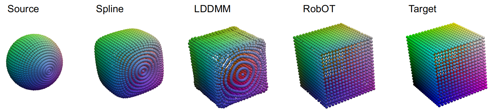
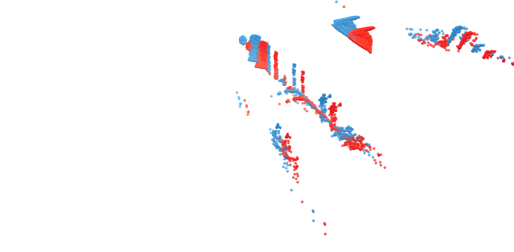

## Shapmagn

This is the repository for the paper "Accurate Point Cloud Registration with Robust Optimal Transport" (oming soon).

The repository provides a general framework for the point cloud/mesh registration and general deep learning frameworks, supporting both optimization and learning
based approaches. 


## Instalation


For detailed instructions refer to [INSTALL.md](INSTALL.md).

## Demo
We provide a series of demos, which can be found at shapmagn/demos
Here are two examples on how to run the optimization-based demos :

### Optimization demos
```
cd shapmagn/shapmagn/demos
python 2d_toy_reg.py
python ot_fun.py
python toy_reg.py
python partial_prealign_reg.py
python lung_gradient_flow.py
python lung_reg.py
python flyingkitti_reg.py
python ot_sampling.py
```

### Deep demo on Lung vessel tree

Here is an example on deep feature learning on lung vessel dataset:
```
python run_task.py -ds ./demos/data/lung_data/lung_dataset_splits -o ./demos/output/training_feature_learning_on_one_case -tn deepfeature_pointconv_train -ts ./demos/settings/lung/deep_feature_training -g 0
```

Here is an example on robust optimal transport based deep feature projection (spline) on lung vessel dataset:
```
python run_eval.py -dj ./demos/data/lung_data/lung_dataset_splits/test/pair_data.json -o ./demos/output/test_feature_projection_one_case/deepfeature_pointconv_projection -ts ./demos/settings/lung/deep_feature_projection -g 0
```

Here is an example on training a pretrained deep LDDMM flow network on one real pair:

```
python run_task.py  -ds ./demos/data/lung_data/lung_dataset_splits -o ./demos/output/train_deepflow_on_one_case -tn deepflow_pwc_lddmm -ts ./demos/settings/lung/deep_lddmm_flow   -g 0
```

Here is an example on evaluating a pretrained deep LDDMM flow network on one real pair:

```
python run_eval.py -dj ./demos/data/lung_data/lung_dataset_splits/test/pair_data.json -o ./demos/output/test_deepflow_on_one_case/deepflow_pwc_lddmm -ts ./demos/settings/lung/deep_lddmm_flow  -m   ./demos/pretrained_models/lung_model/pretrained_deep_lddmm -g 0
```

### Deep demo on Kitti

#### Prepare Kitti data
We need prepare the data of KITTI Scene Flow 2015 first. Here we follow the instruction in [PointPWC](https://github.com/DylanWusee/PointPWC).

Download and unzip [KITTI Scene Flow Evaluation 2015](http://www.cvlibs.net/download.php?file=data_scene_flow.zip) to directory `RAW_DATA_PATH`.
Run the following script for kitti data preprocessing, the processed data are saved in `PROCESSED_DATA_PATH`; A shapmagn compatible format is saved in `SHAPMAN_INTPUT_PATH`:

```
cd shapmagn/experiments/datasets/flying3d_and_kitti/flyingkitti_nonocc
python process_kitti_raw_data.py RAW_DATA_PATH PROCESSED_DATA_PATH
python prepare_data_test_on_kitti.py RAW_DATA_PATH PROCESSED_DATA_PATH SHAPMAN_INTPUT_PATH
```

Here is an example on evaluating a spline flow network on 142 Kitti pairs:

```
python run_eval.py -dj SHAPMAN_INTPUT_PATH/pair_data.json -o ./demos/output/test_deepflow_on_kitti/deep_spline -ts ./demos/settings/kitti/deep_spline_flow  -m ./demos/pretrained_models/kitti_model/pretrained_deep_spline -g 0
```

Here is an example on evaluating a displacement network(PWC) that combined ot prealigned and ot postprocessing on 142 Kitti pairs:
```
python run_eval.py -dj SHAPMAN_INTPUT_PATH/pair_data.json -o ./demos/output/test_deepflow_on_kitti/deep_pwc -ts ./demos/settings/kitti/official_released_pwc_model_with_ot_prealigned_and_post  -m ./demos/pretrained_models/kitti_model/PointConv_726_0.0463.pth -g 0
```

## Gallery

Here are some examples on supported functions:

**[Robust Optimal Transport (RobOT)](shapmagn/demos/ot_fun.py)**:


**[RobOT Projection (Partial Rigid Registration)](shapmagn/demos/partial_prealign_reg.py)**:
  

**[RobOT Projection (Spline, LDDMM)](shapmagn/demos/toy_reg.py)**:
  

**Lung vessel Registration**:
  
 
**[Scene Flow Estimation](shapmagn/demos/flyingkitti_reg.py)**:
  

**Unsupervised Feature Learning**:
  
 
**[Synthesized Data Pair Generation](shapmagn/experiments/datasets/lung/lung_data_aug.py)**:
  
